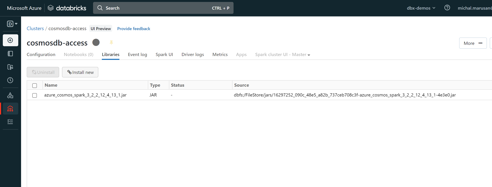

# Cosmos DB connector for Spark

Connector info: 
https://learn.microsoft.com/en-us/java/api/overview/azure/cosmos-spark_3-1_2-12-readme?view=azure-java-stable

Manage Cosmos DB via connector:
https://learn.microsoft.com/en-us/azure/cosmos-db/nosql/quickstart-spark?source=recommendations&tabs=python

The connector needs to be installed in the cluster:



Connector configuration inside notebook:

```python
cosmosEndpoint = "https://<COSMOSDB_NAME>.documents.azure.com:443/"
cosmosMasterKey = dbutils.secrets.get(scope = "SECRETSCOPE", key = "cosmos-db-master-key")
cosmosDatabaseName = "DBNAME"
cosmosContainerName = "COLLECTIONNAME"

cfg = {
  "spark.cosmos.accountEndpoint" : cosmosEndpoint,
  "spark.cosmos.accountKey" : cosmosMasterKey,
  "spark.cosmos.database" : cosmosDatabaseName,
  "spark.cosmos.container" : cosmosContainerName,
}
```

### Write to Cosmos DB from Spark

```python
# store to Cosmos DB
df.write\
   .format("cosmos.oltp")\
   .options(**cfg)\
   .mode("APPEND")\
   .save()
```

### Read from Cosmos DB
```python
df = spark.read\
    .format("cosmos.oltp")\
    .options(**cfg)\
    .option("spark.cosmos.read.inferSchema.enabled", "true")\
    .load()
```