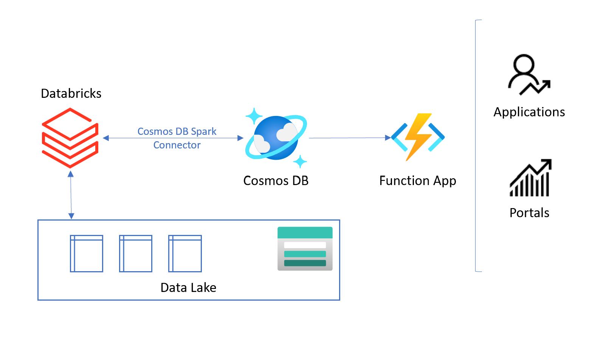

# Read/Write data to Cosmos DB from Spark (Azure Databricks)

This repo demonstrates simple scenario of exposing data from Data Lake as API to external users. Data are created in Azure Databricks, land in Delta Tables. Then are loaded into Cosmos DB thorugh Azure Cosmos DB OLTP Spark 3 connector. From Cosmos DB dat are exposed thorugh API in Azure Functions.



Components:
- Azure Databricks - create / transforms / process batch data and creates Delta tables, see: [databricks/readme.md](./databricks/readme.md)
- Azure Cosmos DB - stores batch data - e.g. customer profiles, customer segmentation, product details, etc., see: [cosmosdb/readme.md](./cosmosdb/readme.md)
- Azure Functions - exposes API for get data from Cosmos DB - single point read operation


## Azure Functions

I will be sending REST to APIs for getting sinlge customer data, using `id` as query (GET) parameter:
`https://DN_NAME.azurewebsites.net/api/getcust?id=<myid>`


`functions.json`:
```json
 {
      "type": "cosmosDB",
      "name": "customerItem",
      "databaseName": "DB_NAME",
      "collectionName": "COLLECTION_NAME",
      "connectionStringSetting": "CosmosDbConnectionString",
      "direction": "in",
      "Id": "{Query.id}",
      "PartitionKey": "{Query.id}"
    }
  ],
```

Function code in `__init__.py`:

```python

def main(req: func.HttpRequest, customerItem: func.DocumentList) -> str:
    if not customerItem:
        logging.warning("Customer item not found")
    else:
        logging.info("Found Customer item, id=%s",
                     customerItem[0]['id'])
        
        # actual columns in Cosmos DB collection
        ret = {
                    "id": customerItem[0]['id'],
                    "firstname": customerItem[0]['firstname'],
                    "lastname": customerItem[0]['lastname'],
                    "email": customerItem[0]['email'],
                    "date": customerItem[0]['date1'],
                    "feat0": customerItem[0]['feat0'],
                    "feat1": customerItem[0]['feat1'],
                    "feat2": customerItem[0]['feat2'],
                    "feat3": customerItem[0]['feat3'],
               }
        return func.HttpResponse(
            json.dumps(ret),
            mimetype="application/json",

        )

    return 'OK'

```

Result:


Code:
```python

import requests
import json

url = "https://DB_NAME.azurewebsites.net/api/getcust?id=myid"

payload = ""
headers = {
  'Content-Type': 'application/json'
}

response = requests.request("GET", url, headers=headers, data=payload)

print(response.text)

```


